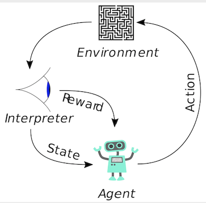
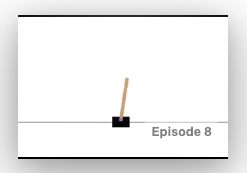

# Reinforcement Learning Introduction

Reinforcement Learning with OpenAI Gym



Here, I first provide gentle introduction to OpenAI Gym interface to play with in-built environment. You can setup your python environment by installing gym package as 
```
> pip install gym
```

This will install only minimal requirements. Follow the source [repo](https://github.com/openai/gym) for complete installation.

Notebook __Gym.ipynb__ gives the introduction to OpenAI Gym with CartPole example. 




Next, __Q-Learning.ipynb__ notebook demonstrates Q-learning method with the help of Cart Pole example. For conceptual understanding of this method, refer to [book by Sutton & Barto](https://web.stanford.edu/class/psych209/Readings/SuttonBartoIPRLBook2ndEd.pdf) chapter 6. Cart Pole environment is simulated using [OpenAI Gym](https://gym.openai.com/). 

Following concepts are discussed in this notebook -

### Reinforcement Learning Components
  * __Environment__
    * Create/Import Environment
    * Analyze State Variables
  * __Observer__
    * State Observer (Feature Generator)
    * Example
  * __Model__
    * Define Learning Model for Agent 
    * Define Learning Procedure (Q-Learning)
  * __Play the Game__
    * Start an Epoch
    * Use termination criteria
  * __Model Training__
    * Initialize Parameters
    * Analyze 
  * __Parameters Tuning__